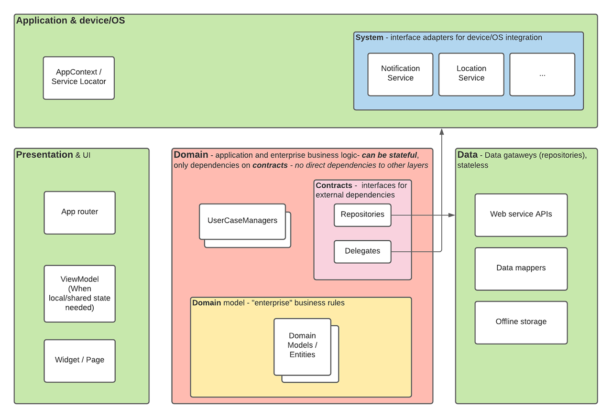

# Flutter Labinar Demo app

Demo-app med en någorlunda komplett arkitektur (baserad på Clean Architecture), för att labba runt med på egen hand - använder asynkron programmering (Futures, async/await), navigation, listvy, http-anrop (eller mockat data) och använder `InheritedWidget` för att kunna nå andra delar/lager i appen.

## Kort om arkitektur
Arkitekturen i appen baserar sig på Clean Architecture. 

 

## Översikt av filstruktur

### application
Här ligger "top-level" komponenter, som bland annat knyter ihop lager mellan varandra. 
Här återfinns vanligen också device/OS-specifika tjänster. 

### data
I detta lager finns exempelvis implementationer av web-service-API:er samt mappning av data will modellobjekt. 
Här finns exempel på både mockat data samt data hämtat från web service. 

### domain
Här ligger kärnan av affärslogiken i klassen. Färmst återfinns detta i s.k. `User case managers`, som var och en är fokuserad på en del av domänen, eller specifikt ett eller flera use case i domänen. 

### presentation
Presentationslaget. Här återfinns sidor (pages), komponenter och vymodeller etc.
